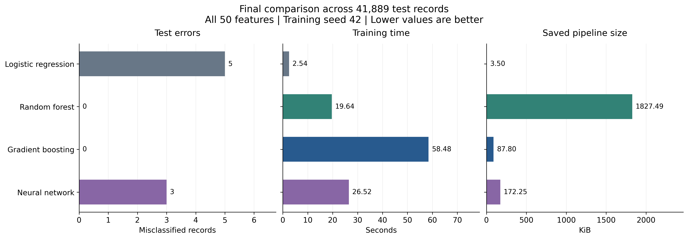
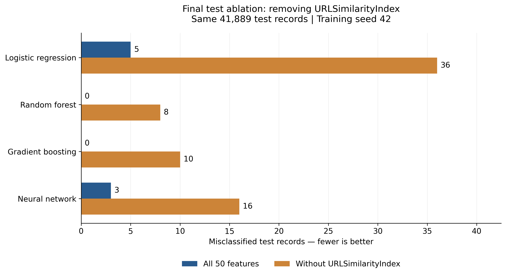

# Phishing Website Detection: Dataset Audit and Algorithm Comparison

**Course:** CSBP711 — Advanced Artificial Intelligence, Fall 2026  
**Authors:** Meera Alalawi and Shamma Alalawi  
**Institution:** United Arab Emirates University

[Open the notebook in Colab](https://colab.research.google.com/github/meeera0/PhiUSIIL_Algorithm_Comparison/blob/main/CSBP711_PhiUSIIL_Algorithm_Comparison.ipynb)

## Objective

Compare four classification algorithms on the PhiUSIIL dataset using
domain-separated partitions, reproducible preprocessing, and a controlled
feature ablation.

The task connects to our interest in cybersecurity and trustworthy threat
detection: high benchmark scores must be interpreted alongside data quality,
feature construction, false alarms, and generalization limits.

## Dataset

- **Name:** PhiUSIIL Phishing URL (Website)
- **Source:** https://archive.ics.uci.edu/dataset/967/phiusiil+phishing+url+dataset
- **Creators:** Arvind Prasad and Shalini Chandra
- **Dataset licence:** Creative Commons Attribution 4.0 International
  (https://creativecommons.org/licenses/by/4.0/)
- **Download timestamp:** 2026-10-03 22:28:15 UTC
  (2026-10-04 in the UAE).
- **Acquisition:** `ucimlrepo.fetch_ucirepo(id=967)`
- **Original size:** 235,795 records and 56 columns.
- **Labels:** 0 = phishing; 1 = legitimate.

The dataset contains URL and webpage-derived features. The accompanying
paper describes legitimate sources based on Open PageRank and phishing
sources including PhishTank, OpenPhish, and MalwareWorld. We use the
provided features rather than collecting or visiting the websites.

The 56 columns comprise 54 candidate predictors, a filename identifier,
and the target label. Our experiment uses 50 numeric predictors, excluding
the raw URL, domain, TLD, title, filename, and target. The added source-row
identifier is also excluded from model inputs.

## Data audit and preparation

The audit found no missing cells, blank strings, infinite numeric values,
constant columns, or exact duplicate rows.

We found 425 repeated URL entries with no conflicting labels. Keeping
the first occurrence of each URL left 235,370 records:

- Phishing: 100,520 (42.71%)
- Legitimate: 134,850 (57.29%)

Domain grouping uses the bundled Public Suffix List through `tldextract`.
Private suffixes are excluded, so some hosting platforms are grouped at
their shared parent domain. IP addresses are grouped by address.

## Evaluation protocol

We targeted 60%/20%/20% of domain groups for training, validation, and test.
Unequal group sizes produced the following record counts:

| Partition | Records | Phishing | Legitimate |
|---|---:|---:|---:|
| Training | 148,453 | 67,330 | 81,123 |
| Validation | 45,028 | 18,247 | 26,781 |
| Test | 41,889 | 14,943 | 26,946 |

No retained URL or domain group crosses partitions.

All models use the same partitions and a StandardScaler pipeline.
Scaling statistics are fitted on training records only. Each ablation
pipeline is fitted again using its reduced training feature set.

- Primary metric: phishing F1, treating label 0 as positive.
- Additional metrics: precision, recall, false-positive rate, accuracy,
  MCC, and error counts.
- Training seeds: 42, 123, and 2026 for validation stability.
- The data split stays fixed across training seeds.
- Final test evaluation uses the original seed-42 pipelines.
- No models were refitted or settings changed during final test evaluation.

## Algorithms

| Method | Main settings |
|---|---|
| Logistic regression — simple baseline | L2 regularization, C=1, L-BFGS, max_iter=2000 |
| Random forest | 100 trees, min_samples_leaf=2, max_features="sqrt", n_jobs=1 |
| Gradient boosting | 100 trees, learning_rate=0.1, max_depth=3 |
| Neural network (MLP) | One 100-neuron ReLU hidden layer, Adam, batch_size=256, max_iter=200, early_stopping=False |

The MLP has 5,201 trainable weights and biases with all 50 inputs.
Its original run completed 16 epochs, stopping on training-loss
improvement rather than validation-based early stopping.

## Final test results

All 50 features, training seed 42, 41,889 test records.

| Model | Phishing F1 | Errors | Training seconds | Pipeline KiB |
|---|---:|---:|---:|---:|
| Random forest | 1.000000 | 0 | 19.64 | 1827.49 |
| Gradient boosting | 1.000000 | 0 | 58.48 | 87.80 |
| Neural network | 0.999900 | 3 | 26.52 | 172.25 |
| Logistic regression | 0.999833 | 5 | 2.54 | 3.50 |

All four full-feature models produced zero false-positive alerts.
Training times are single-run measurements on the original runtime.
Pipeline size is measured using pickle protocol 5 and includes the scaler
and retained estimator state; it is not a parameter count.

## Feature ablation

We removed `URLSimilarityIndex` and retrained each method using the same
partitions, settings, seed, and preprocessing procedure.

| Model | Test errors: all 50 | Test errors: without USI |
|---|---:|---:|
| Logistic regression | 5 | 36 |
| Random forest | 0 | 8 |
| Gradient boosting | 0 | 10 |
| Neural network | 3 | 16 |

Removing USI increased errors for every method and broke the leading
test tie in favour of random forest. However, all models retained very
high performance.

## Interpretation and limitations

Several supplied features strongly separate the two classes. An
exploratory training-only diagnostic found direction-adjusted individual
feature AUCs of 0.9964 for URLSimilarityIndex, 0.9911 for LineOfCode,
0.9878 for NoOfExternalRef, and 0.9858 for NoOfImage.

This diagnostic was added after the main evaluation and did not change
the models or settings. These AUCs describe feature ranking separation,
not classification accuracy.

The strong separation helps explain the near-perfect performance,
including that of the linear baseline. Thresholds and feature
interactions are a plausible explanation for the small ensemble
advantage, but our ablation does not isolate that mechanism.

Important limitations:

- The near-perfect baseline limits the task's difficulty and the strength
  of claims about algorithm superiority.
- Domain separation does not rule out collection-specific patterns or
  leakage in supplied reference-derived features.
- Training-seed stability was assessed on one fixed validation partition,
  not across multiple data splits.
- Final test results use one training seed.
- Zero observed errors do not establish perfect real-world detection.
- The single-feature ablation demonstrates feature dependence, not
  causation or proof of leakage.

## Reproduce the experiment

1. Open the notebook using the Colab link above.
2. Connect to a CPU runtime; a GPU is not required.
3. Run all cells from top to bottom in a fresh session.
4. The notebook downloads the dataset and performs auditing, cleaning,
   domain grouping, splitting, training, evaluation, and plotting.
5. The final export cell creates and downloads `CSBP711_results.zip`.

Internet access is required for package installation and dataset download.
No local dataset paths or credentials are required.

The recorded package versions are in
[requirements.txt](CSBP711_results/requirements.txt).
The original Python version was 3.13.15. Colab environments may change;
matching the recorded software versions improves reproducibility.
Runtime measurements may vary with hardware and system load.

## Repository contents

- `CSBP711_PhiUSIIL_Algorithm_Comparison.ipynb`: complete notebook.
- `CSBP711_results/`: 17 CSV tables, requirements, and experiment metadata.
- `CSBP711_results/figures/`: eight figures, each in PNG and PDF.
- `CSBP711_results/split_manifest.csv`: source-row and partition assignments.
- `CSBP711_results/test_predictions.csv`: saved predictions for all eight
  final-test pipelines.
- `CSBP711_results/experiment_metadata.json`: acquisition timestamp,
  software versions, features, seeds, and model settings.

## Contributions

- **Shamma Alalawi:** Initial exploration and algorithm experiments in
  Orange, documented in the preliminary work.
- **Meera Alalawi:** Implementation and execution of the Colab workflow
  with AI assistance, preparation of figures and exports, and repository
  setup.

This section records completed contributions and will be updated to
reflect further work by each member.

## AI assistance disclosure

ChatGPT/Codex was used to assist with experimental planning, Python code,
debugging, visualization, explanations of machine-learning concepts,
and drafting documentation and interpretation.

The reported results were generated by executing the notebook in Google
Colab. They were not copied from published papers or leaderboards.
AI-assisted explanations were checked against the observed outputs;
limitations and unresolved interpretations are stated explicitly.

## References and software

- Prasad, A., and Chandra, S. (2024). *PhiUSIIL Phishing URL (Website)*.
  UCI Machine Learning Repository.
  https://archive.ics.uci.edu/dataset/967/phiusiil+phishing+url+dataset
- Prasad, A., and Chandra, S. (2024). *PhiUSIIL: A diverse security
  profile empowered phishing URL detection framework based on similarity
  index and incremental learning*. Computers & Security.
  https://doi.org/10.1016/j.cose.2023.103545
- Scikit-learn: https://scikit-learn.org/
- pandas: https://pandas.pydata.org/
- NumPy: https://numpy.org/
- SciPy: https://scipy.org/
- Matplotlib: https://matplotlib.org/
- ucimlrepo: https://github.com/uci-ml-repo/ucimlrepo
- tldextract: https://github.com/john-kurkowski/tldextract
- Google Colab: https://colab.research.google.com/
- Orange, used for preliminary exploration: https://orangedatamining.com/
